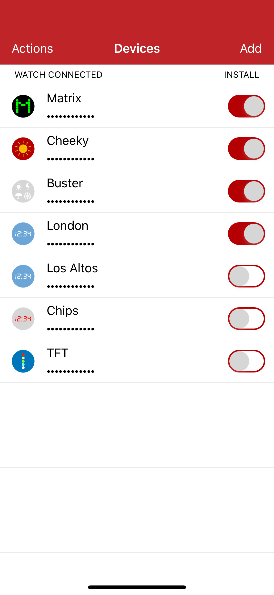
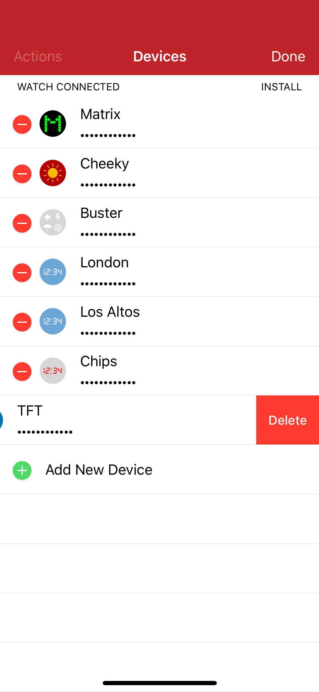
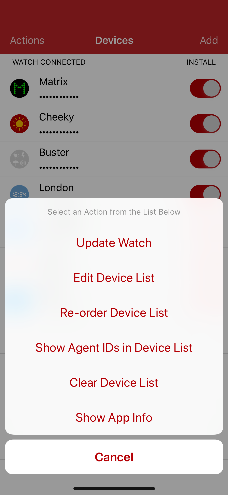
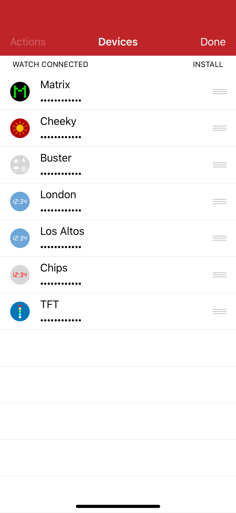

# Controller 1.1.0 #

Control Electric Imp Platform-based Internet of Things devices from your Apple Watch.

## Usage ##

The iPhone app provides a means to add devices — enter the device’s agent ID and a name — and sync the list of devices to the Watch app, which will provide an appropriate UI for each type of device. As such it is currently limited to the device types that I use, but the design is modular, so others can create UIs and *WKInterfaceController* objects of their own to personalise the app for their use.

Or simply take the code apart and use it as the foundation for a completely different UI — the choice is yours.

## Design ##

### iOS App ###

The Watch app’s iPhone-based companion collates your imp-enabled devices and syncs them with the Watch. Tap ‘Edit’ to add a new device and then select it in order to give it a convenient name and to enter its agent ID. Tap ‘Get Device Data’ to check what app the device is running and whether it is supported by Controller. Click ‘Devices’ to go back when you’re done.

&nbsp;&nbsp;&nbsp;&nbsp;

Typically, the iOS app will only be used to add devices. An end-user should not need to use it too often.

Each device is listed with a switch which can be used to sync that device with the Watch app, either to add or remove it.

You can update the Watch separately by tapping ‘Actions’ and then ‘Update Watch’. This is also useful if you re-order the list of devices. Re-ordering is activated by tapping ‘Actions’ and then ‘Re-order Device List’.

&nbsp;&nbsp;&nbsp;&nbsp;

The app stores the current list of devices across app restarts and relaunches.

The list is sync’d with the Watch by sending a string of all the devices to appear on the Watch: device name, agent ID and UUID fields are separated by newlines; device records are separated by two newlines. The string is absolute: it contains all the devices to appear on the Watch from the point it is sent; the Watch app recreates its own list from the string.

The app contains a file, `apps.json`, which lists the apps’ UUIDs and human-readable names as an array of objects within the *apps* object:

```
{ "apps": [
    { "code": "<UUID_1>",
      "name": "APP_NAME_1" },
    { "code": "<UUID_2>",
      "name": "<APP_NAME_2" } ]
}
```

This file is read at launch and used to determine which icons to display based upon the UUID provided by the app’s Agent code. All local app data look-ups used this file’s contents. As such it provides a single place to update app details, though please note that the app icon’s filename should match the app’s name in lower case, for example:

| App Name | App icon name |
| --- | --- |
| myApp | myapp(.png/jpg/tif) |

You should embed the same `apps.json` in both your iOS and Watch app bundles. A sample file is included in this repo.

### Watch App ###

The Watch app presents a list of available devices. Selecting any of these presents a standard UI customised for the application the device is running. The device-specific UI presents the name of the device; its application type; a series of controls relevant to the device; and finally a button which takes the user back to the device list (easier than tapping on the tiny title bar).

The *WKInterfaceController* instance which manages the device-specific UI is designed to hide the device controls until it has received status information from the the device’s agent — see below. Once this information is received, the UI is unhidden and  is ready for use. The *WKInterfaceController* instance presents a dynamic 'Loading...' label to inform the user that this process is taking place.

### Squirrel ###

The Electric Imp application component of the design makes use of the [Rocky library](https://developer.electricimp.com/libraries/utilities/rocky) to serve standard application information at /info, and a device status (online or offline) information at /status. These and other application control endpoints can of course be modified as required — just update the appropriate section of the relevant *WKInterfaceController* instance.

## Release Notes ##

- 1.1.0 &mdash; *Unreleased*
    - Add support for multiple Apple Watches
    - Update the iOS app UI:
        - Add a new device without editing the table by adding **Add** button to nav bar.
        - Add **Edit Device List** option to **Actions** menu.
        - Don't indent device list when re-ordering it.
        - Hide installation switch during device list re-ordering and editing.
        - Disable **Update Watch** action when watchOS app not yet installed.
    - Device list's installation switch should now be correctly enabled/disabled at start-up.
    - Fix support for some of my imp apps whose APIs recently changed.
- 1.0.2 &mdash; *8 May 2019*
    - Show amber icon during connection attempts.
    - Fix minor Swift issues identified by compiler.
    - Remove images from repository.
- 1.0.1 &mdash; *14 November 2018*
    - Enable 3D Touch shortcut to app's GitHub page.
    - Tidy repo and tweak code:
        - Remove auto-increment on build number.
        - Remove iOS app, watchOS app and imp app icon art.
- 1.0.0 &mdash; *3 October 2018*
    - Initial release.

## To Do ##

- Add support for multiple Watches.

Copyright &copy; 2018-19 by Tony Smith.

Controller is made available under the MIT licence.
